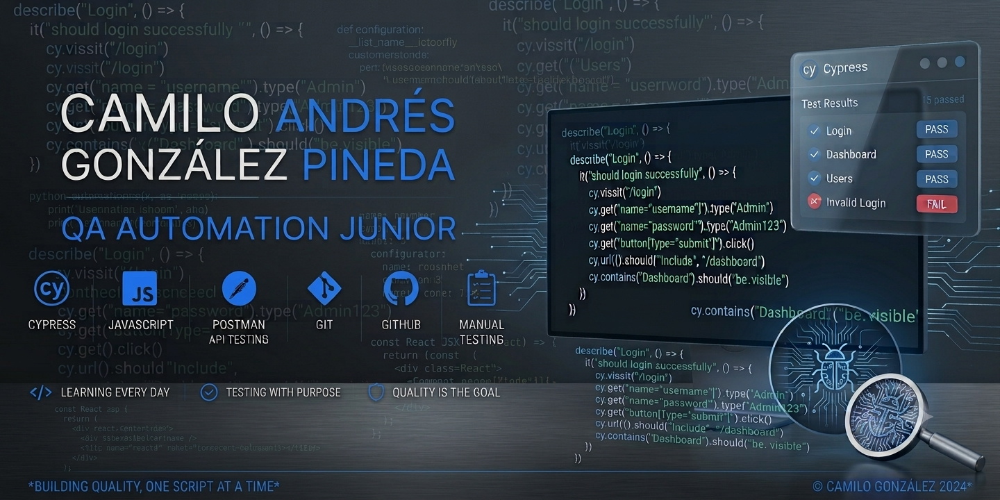

  

# 👋 Hola, soy Camilo Andrés González Pineda

## QA Automation Junior

Soy QA Automation Junior con formación en Desarrollo de Software y actualmente estoy buscando mi primera oportunidad profesional en el área de Quality Assurance.

Me he enfocado en aprender y aplicar pruebas manuales y automatizadas para aplicaciones web utilizando **Cypress** y **JavaScript**, desarrollando proyectos prácticos que fortalecen mis conocimientos en automatización de pruebas End-to-End (E2E), validación funcional y aseguramiento de la calidad del software.

Actualmente continúo ampliando mis conocimientos en **API Testing con Postman**, además de seguir fortaleciendo mis habilidades en automatización y buenas prácticas de QA.

  
  &nbsp;&nbsp;&nbsp;&nbsp;&nbsp;&nbsp;
  
  &nbsp;&nbsp;&nbsp;
  
  &nbsp;&nbsp;&nbsp;&nbsp;&nbsp;&nbsp;
  
  &nbsp;&nbsp;&nbsp;&nbsp;&nbsp;&nbsp;
  
  &nbsp;&nbsp;&nbsp; &nbsp;&nbsp;&nbsp;
  
  &nbsp;&nbsp;&nbsp;&nbsp;&nbsp;&nbsp;
  
  &nbsp;&nbsp;&nbsp;&nbsp;&nbsp;&nbsp;
  

#  Tecnologías y Herramientas

### QA & Testing

* Manual Testing
* Functional Testing
* UI Testing
* End-to-End Testing (E2E)
* Smoke Testing
* Regression Testing
* Test Case Execution
* Bug Reporting

### Automatización

* Cypress
* JavaScript

### API Testing

* Postman (Nivel básico)
* REST API Fundamentals

### Herramientas

* Git
* GitHub
* VS Code
* Chrome DevTools

### Tecnologías

* HTML5
* CSS3
* JSON

### Metodologías

* Agile
* Scrum
* SDLC
* STLC

---

#  Proyectos Destacados

## Cypress OrangeHRM Login Test

Automatización del proceso de autenticación de OrangeHRM utilizando Cypress.

 https://github.com/CamiloGonzalezPineda/Cypress-OrangeHRM-Login-Test

---

## Proyecto Cypress - Automatización de Pruebas

Proyecto práctico enfocado en la automatización de pruebas funcionales sobre aplicaciones web.

 https://github.com/CamiloGonzalezPineda/Proyect-Cypres-Pruebas

---

## QA Init

Proyecto desarrollado para fortalecer fundamentos de Quality Assurance y automatización de pruebas.

 https://github.com/CamiloGonzalezPineda/QA-Init

---

#  Actualmente aprendiendo

* API Testing con Postman
* Automatización de pruebas con Cypress
* Buenas prácticas de QA Automation
* SQL para QA

---

#  Objetivo Profesional

Mi objetivo es iniciar mi carrera como **QA Automation Junior**, aportando compromiso, aprendizaje continuo y una fuerte orientación hacia la calidad del software, mientras continúo desarrollando mis habilidades técnicas y profesionales.

---

#  Contacto

 **[camgp98@gmail.com](mailto:camgp98@gmail.com)**

 **Actualmente abierto a oportunidades como QA Automation Junior.**

